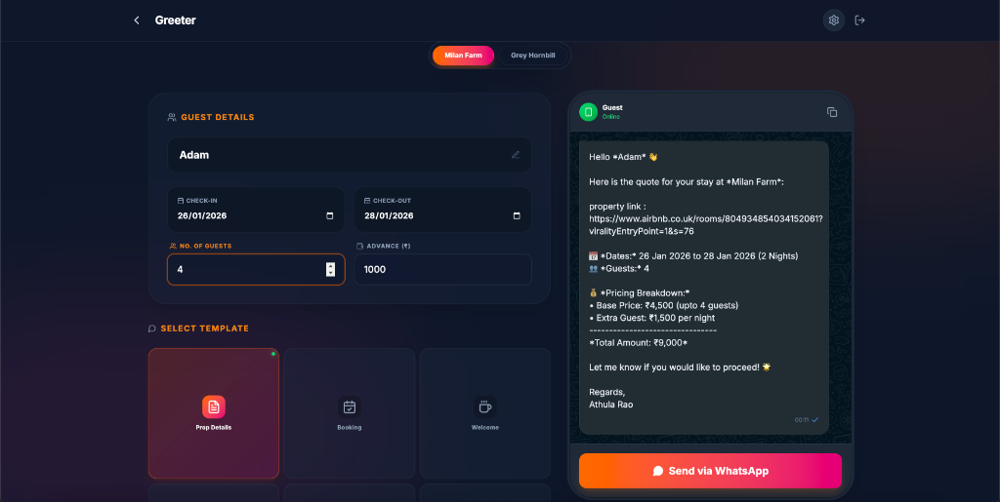
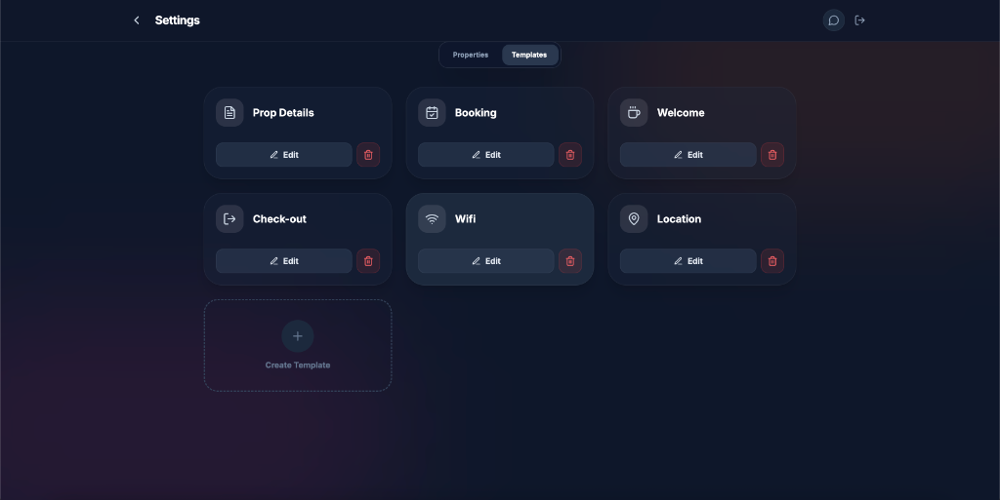

# Guest Greeter

Guest Greeter is a modern, responsive web application designed for Airbnb hosts and property managers. It streamlines the process of generating personalized welcome messages for guests, managing property details, and maintaining reusable message templates.

## 🚀 Features

*   **Property Management**: Easily add, edit, and delete multiple properties. Store details like check-in/out times, WiFi credentials, and location links.
*   **Maintenance Tracker**: Track repairs and issues for each property with status (Pending/Fixed) and priority levels.
*   **Dynamic Templates**: Create custom message templates using variables (e.g., `{{guestName}}`, `{{wifiPass}}`).
*   **Real-time Preview**: See exactly how your message will look on a smartphone (WhatsApp style) before sending.
*   **Instant Calculation**: Automatically calculates total stay cost, nights, and balance due based on check-in/out dates.
*   **One-Click Actions**: Copy messages to clipboard or open directly in WhatsApp.
*   **Secure Authentication**: User accounts powered by Firebase Auth to keep your data private.
*   **Responsive Design**: Fully optimized for both desktop and mobile devices.

## 🛠️ Tech Stack

*   **Framework**: [Next.js 14](https://nextjs.org/) (App Router)
*   **Language**: [TypeScript](https://www.typescriptlang.org/)
*   **Styling**: [Tailwind CSS](https://tailwindcss.com/)
*   **Icons**: [Lucide React](https://lucide.dev/)
*   **Backend / Auth**: [Firebase](https://firebase.google.com/) (Firestore & Authentication)

<div align="center">
  
  
</div>


## 📂 Project Structure

The project follows the Next.js App Router architecture:

```
app/
├── auth/                   # Authentication page
├── greeter/                # Main message generator tool
├── maintenance/            # Maintenance tracker dashboard
├── settings/               # Property & Template management
├── components/
│   ├── ui/                 # Reusable atomic components (Button, Input, Card, etc.)
│   ├── providers/          # Global Context Providers (Auth, Data)
│   ├── AuthForm.tsx        # Authentication form component
│   ├── GuestForm.tsx       # Guest details input form
│   ├── PreviewPhone.tsx    # Mobile message preview component
│   └── ...
├── lib/                    # Utilities, types, and Firebase config
└── page.tsx                # Landing page
```

## 🏁 Getting Started

### Prerequisites

*   Node.js (v18 or higher)
*   npm or yarn
*   A Firebase project

### Installation

1.  **Clone the repository**
    ```bash
    git clone https://github.com/yourusername/guest-greeter.git
    cd guest-greeter
    ```

2.  **Install dependencies**
    ```bash
    npm install
    ```

3.  **Configure Firebase**
    *   Create a `.env.local` file in the root directory.
    *   Add your Firebase configuration keys:
        ```env
        NEXT_PUBLIC_FIREBASE_API_KEY=your_api_key
        NEXT_PUBLIC_FIREBASE_AUTH_DOMAIN=your_project_id.firebaseapp.com
        NEXT_PUBLIC_FIREBASE_PROJECT_ID=your_project_id
        NEXT_PUBLIC_FIREBASE_STORAGE_BUCKET=your_project_id.appspot.com
        NEXT_PUBLIC_FIREBASE_MESSAGING_SENDER_ID=your_sender_id
        NEXT_PUBLIC_FIREBASE_APP_ID=your_app_id
        ```

4.  **Run the development server**
    ```bash
    npm run dev
    ```

5.  **Open the app**
    Visit [http://localhost:3000](http://localhost:3000) in your browser.

## 📖 Usage

1.  **Sign Up/Login**: Create an account to start saving your data.
2.  **Configure Properties**: Go to **Settings > Properties** to add your rental units.
3.  **Create Templates**: Go to **Settings > Templates** to draft your messages. Use the "Insert Variable" feature to add dynamic placeholders.
4.  **Generate Messages**:
    *   Go to **Start Greeting**.
    *   Select a property and a template.
    *   Enter guest details (Name, Dates, etc.).
    *   Review the generated message in the phone preview.
    *   Click **Send via WhatsApp** or **Copy**.

## 📄 License

This project is licensed under the MIT License.
